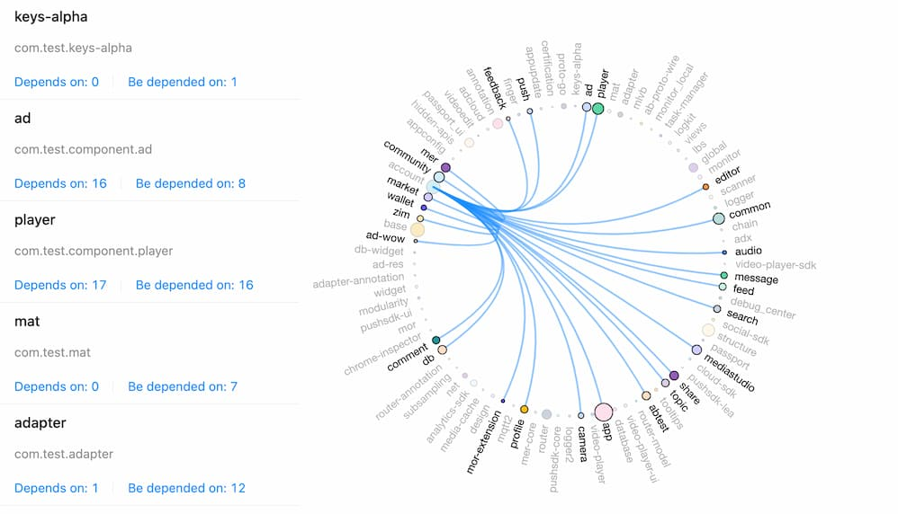

The `${lastest-version}` of this plugin is [](https://jitpack.io/#nekocode/gradle-dependency-graph)
. Copy below code to the `build.gradle` of your android application project.

```gradle
buildscript {
    repositories {
        maven { url "https://jitpack.io" }
    }
    dependencies {
        classpath "com.github.nekocode:gradle-dependency-graph:${lastest-verion}"
    }
}

apply plugin: "dep-extract"
 
//extractDep {
//    outputFile = project.rootProject.file("dep.json")
//    nodeFilter = { nodeName -> true }
//    edgeFilter = { sourceNodeName, targetNodeName -> true }
//}
```

Now, you can extract the dependency graph of corresponding buildType into a json file by running gradle task `extractDep${buildType}` (such as `extractDepRelease`).

#### Visualize:

Drag and drop the output json file to the website [nekocode.github.io/gradle-dependency-graph](https://nekocode.github.io/gradle-dependency-graph).


